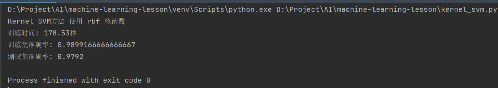

# 模式识别与机器学习实验报告

## 数据集准备

数据集使用教务网站中给定的`mnist.mat`，其中包含了60000个训练样本和10000个测试样本，每个样本为28*
28的灰度图像，每个像素点的灰度值为0-255之间的整数，每个样本的标签为0-9之间的整数，表示该样本所代表的数字。

## 数据集处理

### 数据集转化为sci-kit learn中的数据格式

由于数据集中的数据格式为matlab格式，因此需要将其转化为sci-kit learn中的数据格式，即`sklearn.datasets`的格式，转化的代码如下：

```python
def split_train_test_dataset():
    mnist_data = loadmat('./dataset/mnist_all.mat')
    labels = range(0, 10)
    x_train_arr = []
    y_train_arr = []
    x_test_arr = []
    y_test_arr = []
    for label in labels:
        train_data = mnist_data[f'train{label}']
        x_train_arr.extend(train_data)
        y_train_arr.extend([label] * len(train_data))

        train_data = mnist_data[f'test{label}']
        x_test_arr.extend(train_data)
        y_test_arr.extend([label] * len(train_data))

    return np.array(x_train_arr), np.array(y_train_arr), np.array(x_test_arr), np.array(y_test_arr),
```

### 数据集转换为pytorch中的数据格式

由于pytorch中的数据格式为`torch.utils.data.Dataset`,同时使用神经网络需要提供数据的data_loader，因此需要将数据集转换为pytorch中的数据格式，转换的代码如下：

首先是读取mnist文件转换为具有pytorch数据格式的数据集：

```python
class MnistDataset(Dataset):
    def __init__(self, root, train=True, transform=None, target_transform=None):
        # 读取mat形式的数据
        all_data = scio.loadmat(root + '/mnist_all.mat')
        image_labels = []
        image_data = []
        # 读取训练集,测试集,以及对应的标签,存入image_data和image_labels中
        if train:
            pre = 'train'
        else:
            pre = 'test'
        for i in range(10):
            dict_key = pre + str(i)
            for data in all_data.get(dict_key):
                image_data.append(data.reshape(28, 28))
                image_labels.append(i)
        self.img_labels = image_labels
        self.img_data = image_data
        self.transform = transform
        self.target_transform = target_transform

    def __len__(self):
        return len(self.img_labels)

    def __getitem__(self, idx):
        image = self.img_data[idx]
        label = self.img_labels[idx]
        if self.transform:
            image = self.transform(image)
        if self.target_transform:
            label = self.target_transform(label)
        return image, label
```

接着提供从数据集中读取数据的data_loader：

```python
def load_dataset(train=True):
    dateset = MnistDataset(root='./dataset', train=train, transform=ToTensor())
    return dateset


def get_dataloader(train=True, batch_size=64, shuffle=True, num_workers=0):
    dataset = load_dataset(train)
    dataloader = DataLoader(dataset, batch_size=batch_size, shuffle=shuffle, num_workers=num_workers)
    return dataloader

```

## 实验

### 实验一: 使用线性分类器对mnist数据集进行分类

> 线性SVM不能跑出来结果，因此使用LogisticRegression模型

LogisticRegression模型，预定义参数为，学习率为0.01，训练代码在`logistic_regression.py`中，训练结果如下：


### 实验二: 使用Kernel SVM对mnist数据集进行分类

kernel svm中不同的核函数可能会有不同的效果，使用不同的核函数效果如下

1. 使用rbf核函数的效果
   
2. 使用poly核函数的效果
   

> kernel svm的训练时间较长,可以看出，使用rbf核函数与poly核函数的效果都不错
> 使用sigmoid核函数和无法收敛出结果，因此没有使用sigmoid核函数的结果
> 使用linear核函数的效果与线性分类器的效果相同，因此没有使用linear核函数的结果

### 实验三: 使用神经网络对mnist数据集进行分类(CNN)

最后是使用pytorch与卷积神经网络对mnist数据集进行分类，训练代码在`cnn.py`中
首先是使用上文中的已经准备好的pytorch格式的data_loader

```python
# 加载数据集
train_loader = get_dataloader(train=True, batch_size=64, shuffle=True, num_workers=0)
test_loader = get_dataloader(train=False, batch_size=64, shuffle=True, num_workers=0)
```

接着定义损失函数与优化器

```python
    # 损失函数
criterion = nn.CrossEntropyLoss()
# 优化器
optimizer = optim.Adam(net.parameters(), lr=0.001)  # 定义优化器，普通的随机梯度下降算法
```

核心部分的代码是定义卷积神经网络，这里我采用了两层卷积层，加全连接层的结构，其中卷积层的参数为`in_channels=1, out_channels=16, kernel_size=5`，`in_channels=16, out_channels=32, kernel_size=5`
，进行flatten操作后进入全连接层，全连接层的参数为`in_features=32 * 7 * 7, out_features=10`，最后一层全连接层的输出为10，代表10个类别，代码如下：

```python
self.conv1 = nn.Sequential(  # 输入大小 (1, 28, 28)
    nn.Conv2d(
        in_channels=1,  # 灰度图
        out_channels=16,  # 要得到几多少个特征图
        kernel_size=5,  # 卷积核大小
        stride=1,  # 步长
        padding=2,  # 填充
    ),  # 输出的特征图为 (16, 28, 28)
    nn.ReLU(),  # relu层
    nn.MaxPool2d(kernel_size=2),  # 进行池化操作（2x2 区域）, 输出结果为： (16, 14, 14)
)
self.conv2 = nn.Sequential(  # 下一个套餐的输入 (16, 14, 14)
    nn.Conv2d(16, 32, 5, 1, 2),  # 输出 (32, 14, 14)
    nn.ReLU(),  # relu层
    nn.MaxPool2d(2),  # 输出 (32, 7, 7)
)
self.out = nn.Linear(32 * 7 * 7, 10)  # 全连接层得到的结果


# 应用卷积层和全连接层
def forward(self, x):
    x = self.conv1(x)
    x = self.conv2(x)
    x = x.view(x.size(0), -1)  # 展平多维的卷积图成 (batch_size, 32 * 7 * 7)
    output = self.out(x)
    return output
```

最终训练结果如下：


## 实验总结

对照以上三种训练方式中的最优结果

| 模型名称                | 模型类型  | 模型训练时间(s) | 模型准确率(训练集) | 模型准确率(测试集) |
|---------------------|-------|-----------|------------|------------|
| Logistic Regression | 线性方法  | 145.5s    | 94.15%     | 92.08%     |
| Kernel SVM          | 非线性方法 | 177.6s    | 98.99%     | 97.92%     |
| CNN                 | 神经网络  | 5min      | 99.67%     | 99.06%     |

可以得到以下结论：

1. 训练速度: 达到收敛的时间上，`Logistic Regression` < `Kernel SVM` < `GNN`。但是`GNN`卷积神经网络能够最快速的收敛到较好的结果。
2. 识别准确率: `CNN`>`Kernel SVM`>`Logistic Regression`，`GNN`的识别准确率最高，其次是非线性分类器，最后是线性分类器，比较符合图像处理的模型优先选择情况。